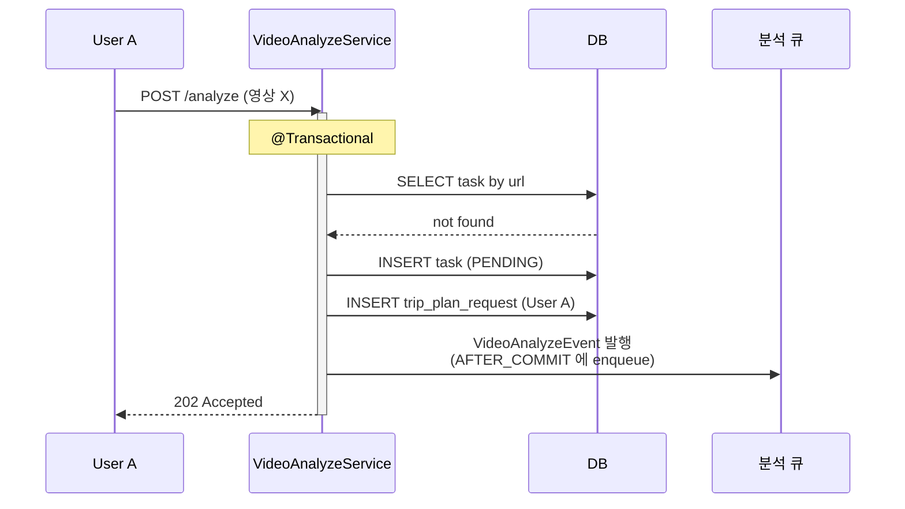
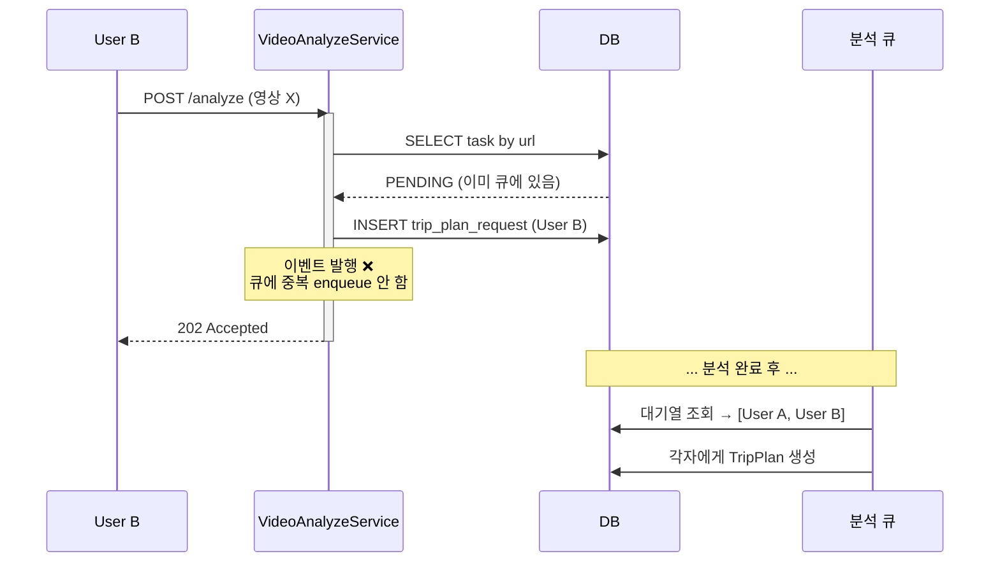
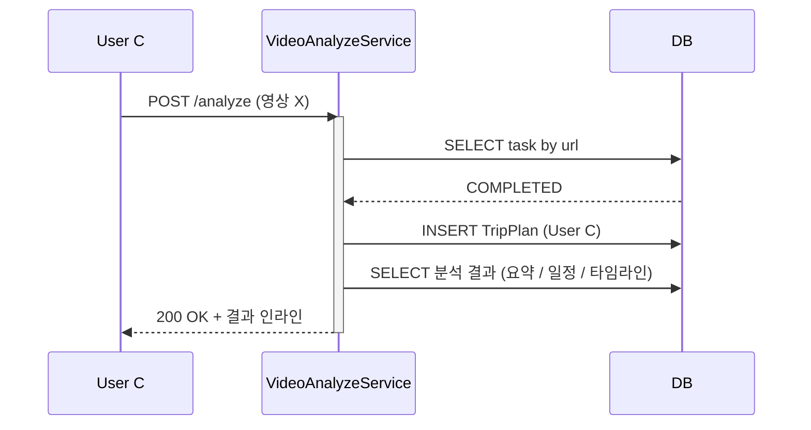
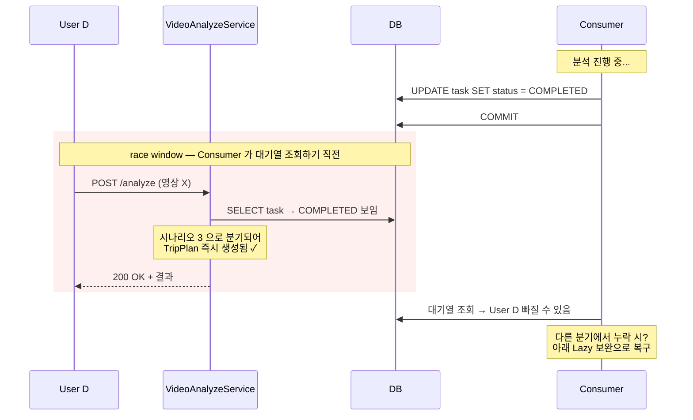
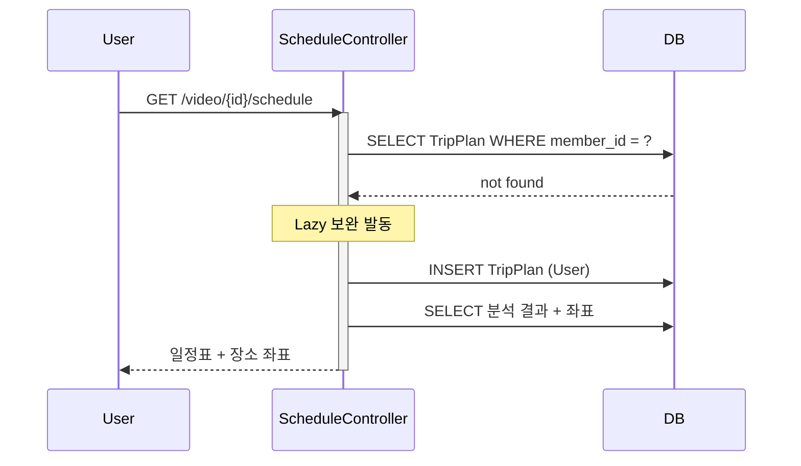
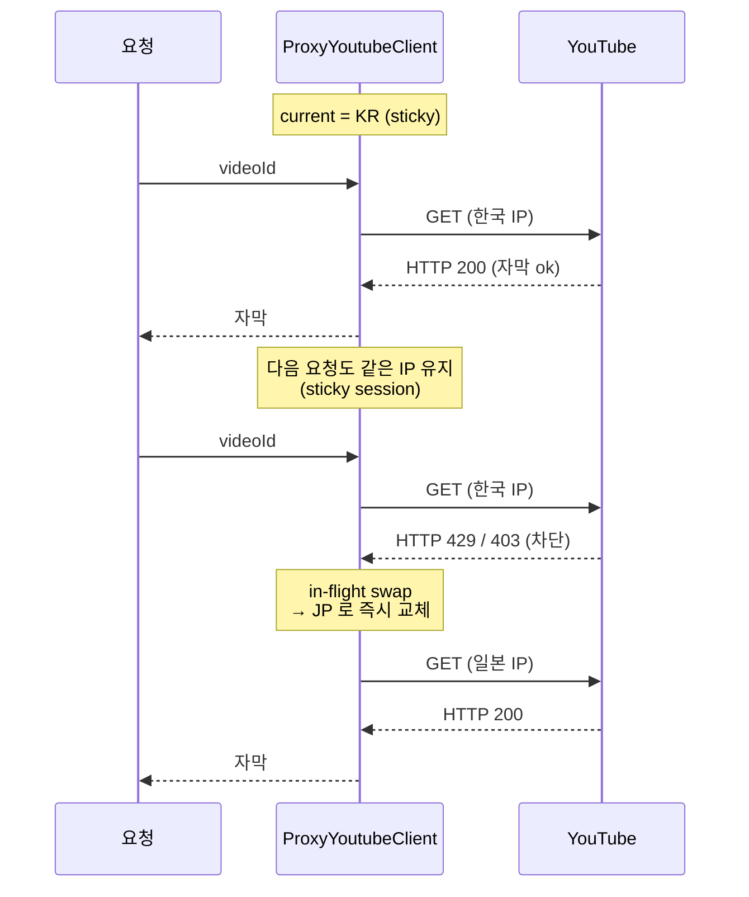
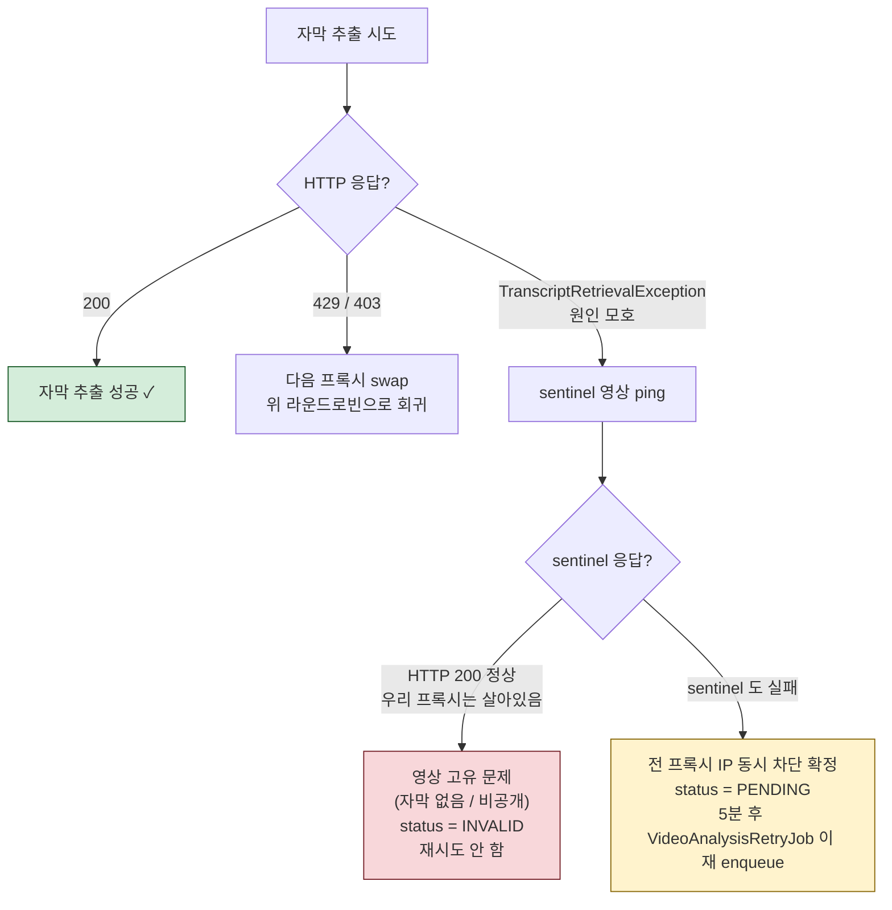

# LinkTrip Backend

유튜브 여행 영상을 AI로 분석하여 일정표를 자동 생성하고, 인기 여행 영상/크리에이터를 수집하여 제공하는 플랫폼입니다.

## Tech Stack

| 분류 | 기술 |
|------|------|
| Language | Kotlin 1.9.25, JDK 21 |
| Framework | Spring Boot 3.4, Spring Batch |
| ORM / Query | JPA, QueryDSL |
| Database | MySQL |
| Cache | Caffeine Cache |
| Infra | AWS EC2, Docker |
| External API | YouTube Data v3, Gemini 2.5 Flash, Google Places API, Discord Webhook, webshare proxy |

---

## 모듈 구조

```
linktrip-bootstrap                 ← Spring Boot 진입점, DI 조립
│
├── linktrip-input-http            ← REST API Controller
├── linktrip-input-batch           ← Spring Batch Job & Scheduler
│
├── linktrip-application           ← 핵심 비즈니스 로직 (Port & Service)
│   ├── domain/                    ← 도메인 모델 + 도메인 서비스
│   │   ├── video/                 ← 영상 분석 도메인
│   │   ├── youtube/               ← 영상 수집 도메인
│   │   ├── trip/                  ← 여행 계획 도메인
│   │   ├── quota/                 ← 외부 API 호출량 가드 + 카운터 + 비용 알림
│   │   └── notification/          ← 알림 이벤트
│   ├── port/input/                ← UseCase 인터페이스
│   └── port/output/               ← Output Port 인터페이스
│
├── linktrip-output-http           ← 외부 API 어댑터 (YouTube, Gemini, Places, Discord, webshare)
├── linktrip-output-cache          ← Caffeine 캐시 데코레이터 어댑터 + 인메모리 큐
├── linktrip-output-persistence    ← MySQL JPA + QueryDSL 어댑터
└── linktrip-common                ← 공통 예외, 이벤트, 설정
```

---

## 아키텍처

### 의존성 방향

```
                         ┌──────────────────────┐
                         │      bootstrap       │
                         │  (모든 모듈 참조,      │
                         │   DI 조립 전용)       │
                         └──────────┬───────────┘
                                    │
         ┌──────────────────────────┼──────────────────────────┐
         ▼                          ▼                          ▼
 ┌──────────────┐          ┌──────────────┐          ┌──────────────┐
 │  input-http  │          │ input-batch  │          │    common    │
 └──────┬───────┘          └──────┬───────┘          └──────────────┘
        │                         │
        │  UseCase Port           │  UseCase Port
        ▼                         ▼
 ┌─────────────────────────────────────────────────────────────┐
 │                       application                           │
 │                                                             │
 │  Domain Service ──→ Output Port Interface                   │
 │                                                             │
 └─────────────────────────────┬───────────────────────────────┘
                               │
              ┌────────────────┼────────────────┐
              ▲                ▲                ▲
     ┌──────────────┐ ┌──────────────┐ ┌──────────────┐
     │ output-cache │ │  output-     │ │  output-http │
     │  (Caffeine + │ │  persistence │ │  (YouTube,   │
     │   in-memory  │ │  (MySQL/JPA) │ │   Gemini,    │
     │   queue)     │ │  @Qualifier  │ │   Places,    │
     │  @Primary    │ │              │ │   Discord,   │
     └──────┬───────┘ └──────────────┘ │   webshare)  │
            │               ↑          └──────────────┘
            │   delegate    │
            └───────────────┘
             Port 인터페이스 타입으로 위임
```

모든 모듈은 `application`의 Port 인터페이스에만 의존합니다. `output-cache`와 `output-persistence`는 서로의 존재를 모릅니다.

### 캐시-영속성 분리 (데코레이터 패턴)

```
Application (Port 인터페이스 정의)
      ↑                    ↑
      │                    │
output-cache            output-persistence
(@Primary)              (@Qualifier)
CachingAdapter          PersistenceAdapter
      │                    ↑
      └── delegate ────────┘
```

- `output-cache`는 동일한 Port 인터페이스를 구현하며, DB 어댑터를 delegate로 래핑
- `@Primary`로 캐시 어댑터가 우선 주입, 내부에서 `@Qualifier`로 DB 어댑터 참조
- 캐시 제거/교체 시 `application` 코드 수정 불필요

### 캐싱 전략

```
Caffeine Cache (TTL 7시간, 최대 100건)

배치 주기(6시간) < TTL(7시간) → 배치 간 캐시 미스 방지
배치 저장 시 @CacheEvict → 전체 무효화 → 다음 요청 시 DB 재조회 (Cache-Aside)
```

---

## 영상 분석 파이프라인

전체 흐름은 **요청 처리 (트랜잭션)** → **이벤트 발행/수신 (큐 적재)** → **백그라운드 소비 (실제 분석)** 3 단계로 분리되어 있습니다.

```
[ ① 요청 처리 — 트랜잭션 안 ]

POST /video/analyze { youtubeUrl }
  │
  ▼
┌────────────────────────────────────────────────────────────┐
│             VideoAnalyzeService                            │
│                                                            │
│  URL 정규화 → 중복 확인                                      │
│  ├─ COMPLETED 영상이면  → schedule 즉시 로드 + 인라인 200    │
│  ├─ INVALID 영상이면     → 200 + status=INVALID            │
│  └─ 신규 / PENDING / FAILED                                │
│       → Task 생성/전이 (PENDING)                            │
│       → 요청 대기열 등록 (memberId)                          │
│       → Events.raise(VideoAnalyzeEvent)  ← Spring 이벤트 발행 │
│       → 202 Accepted                                       │
└────────────────────────┬───────────────────────────────────┘
                         │ AFTER_COMMIT (트랜잭션 커밋 후에만)
                         ▼
[ ② 이벤트 수신 — @TransactionalEventListener ]

┌────────────────────────────────────────────────────────────┐
│         VideoAnalyzeEventListener  (@Async)                │
│                                                            │
│  videoAnalysisQueuePort.enqueue(taskId, url, source)       │
│  → PriorityBlockingQueue 에 적재                            │
└────────────────────────┬───────────────────────────────────┘
                         │ 큐에 enqueue 됨
                         ▼
[ ③ 큐 소비 — 별도 데몬 스레드 ]

┌────────────────────────────────────────────────────────────┐
│         VideoAnalysisQueueConsumer (단일 스레드)             │
│                                                            │
│  loop guard: 외부 API 일일 한도 초과 시 dequeue 차단         │
│       │                                                    │
│  USER 우선순위 dequeue (BATCH 는 USER 비었을 때만)           │
│       │                                                    │
│  1단계: 자막 추출 (webshare 프록시 라운드로빈)                │
│       ├── 한국 IP 우선 → JP → TW → ... 10개 sticky          │
│       ├── 429/403 시 다음 프록시로 즉시 swap                 │
│       └── 모호 실패 → sentinel 영상으로 IP 차단 vs 자막 없음   │
│           구분                                              │
│       │                                                    │
│  2단계: Gemini 2.5 Flash 자막 분석                          │
│       │                                                    │
│  결과 저장 (EAT / ATTRACTION / SHOPPING / TRANSPORTATION)   │
│       │                                                    │
│  대기열 조회 → 각 요청자별 TripPlan 생성                     │
│       │                                                    │
│  Google Places 좌표 매핑 (코루틴 병렬)                       │
│       │                                                    │
│  완료 알림 발송                                              │
└────────────────────────────────────────────────────────────┘
                         │
                         ▼
GET /video/{id}/schedule → 일정표 + 장소 좌표 반환
```

### 이벤트 기반 비동기 흐름 — 왜 이렇게 분리?

```
VideoAnalyzeService                  VideoAnalyzeEventListener        VideoAnalysisQueueConsumer
─────────────────────                ─────────────────────────        ───────────────────────────
@Transactional                       @Async + @TransactionalEvent     데몬 스레드 (부팅 시 시작)
   │                                 Listener(AFTER_COMMIT)               │
   │                                       │                              │
   │ Events.raise(event) ────────────────► │                              │
   │                                       │                              │
   │ ... 트랜잭션 커밋 ...                  │                              │
   │                                       │ (커밋 후에야 호출됨)          │
   │ 202 응답 반환 ◄─────────              │                              │
                                           │                              │
                                           │ queuePort.enqueue() ───────► │
                                           │                              │
                                                                          │ dequeue → 분석
                                                                          │ Gemini, Places, 알림
```

**3 단계로 분리한 이유**:

1. **`@TransactionalEventListener(AFTER_COMMIT)` — DB 커밋 후에만 큐 적재**
   - `Events.raise()` 호출 시점이 아니라 **트랜잭션 커밋 직후** 이벤트가 전달됨
   - 만약 `analyzeVideo` 트랜잭션이 롤백되면 이벤트도 발행되지 않음
   - → DB 에 task 가 없는데 큐에만 좀비 이벤트가 남는 상황 방지 (consistency)

2. **`@Async("VideoAnalyzeExecutor")` — 사용자 응답을 빠르게**
   - 큐 적재 자체는 별도 스레드 풀에서
   - HTTP 응답은 `Events.raise()` 만 마치고 곧장 202 반환 (수 ms)
   - 사용자는 큐 적재를 기다리지 않음

3. **Consumer 는 별도 데몬 스레드**
   - HTTP 요청 흐름과 완전히 분리
   - `PriorityBlockingQueue.poll(1초)` 로 큐를 폴링하며 dequeue
   - quota 가드가 dequeue 자체를 차단할 수 있어 비용 폭주 시점에 깨끗이 멈춤

**메시지 브로커 (Kafka/RabbitMQ) 대신 in-memory 큐를 쓴 이유**:
- 단일 인스턴스 운영 → 분산 큐 불필요
- in-memory `PriorityBlockingQueue` 가 USER/BATCH 우선순위 + FIFO 정렬을 단일 자료구조로 처리
- 부팅 시 PENDING 인 task 를 DB 에서 다시 로드해 큐에 재적재 (`ApplicationInitializer`) → 인스턴스 재시작에도 누락 없음
- 5분마다 `VideoAnalysisRetryJob` 이 stale PENDING 을 재 enqueue → 큐 자체가 사고로 비더라도 self-healing

### POST 응답 형태

`POST /video/analyze` 는 status 에 따라 응답이 달라집니다 (단일 shape `VideoAnalyzeResponse`).

| status | HTTP | 응답 데이터 | 설명 |
|---|---|---|---|
| `COMPLETED` | 200 | 결과 인라인 (요약 / 일정 / 타임라인) | 추가 폴링 불필요 |
| `INVALID` | 200 | id / url / status 만 | 자막 없음 등 영구 종료 |
| `PENDING` / `PROCESSING` | 202 | id / url / status 만 | 클라이언트 폴링 |

### 동시 요청 처리

같은 영상을 여러 사용자가 동시에 / 시차로 요청해도 **분석은 정확히 1회만 수행**하고, 각 요청자에게 **개별 TripPlan 을 생성**합니다.
영상의 현재 상태에 따라 처리 분기가 달라지며, 분석 완료 시점에 race condition 이 발생해도 Lazy 보완으로 자가 복구합니다.

#### 시나리오 1 — 신규 영상 (User A 가 처음 요청)

`video_analysis_task` 도 없고 분석도 진행 중이 아닌 영상. **Task 생성 + 대기열 등록 + 이벤트 발행** 모두 수행.



#### 시나리오 2 — 분석 진행 중 영상 (User B 가 뒤따라 요청)

`task` 가 이미 `PENDING` / `PROCESSING`. **대기열만 등록**하고 **이벤트는 발행 안 함** → 중복 분석 차단.



#### 시나리오 3 — 이미 완료된 영상 (User C 가 나중에 요청)

`task.status = COMPLETED` 이고 분석 결과가 DB 에 있는 상태. **분석 큐 안 거치고 즉시 TripPlan 생성 + 결과 인라인 200**.



#### Race condition + Lazy 보완

**문제**: 분석 완료 커밋과 Consumer 의 대기열 조회 사이의 좁은 창에서 들어온 요청은 `trip_plan_request` 에 들어가긴 하지만 Consumer 가 이미 대기열을 조회한 뒤라 **누락**될 수 있음.



**보완 — GET `/schedule` Lazy 생성**: 어떤 경로로 누락되더라도, 사용자가 일정표를 조회하는 시점에 TripPlan 이 없으면 즉시 생성합니다. 두 번째 요청부터는 정상.



**왜 EXISTS 쿼리가 빠른가**: `trip_plan` 의 `(member_id, video_analysis_task_id)` 가 **유니크 인덱스 + 커버링 인덱스** 라, "이 멤버의 plan 이 있는지" 체크가 인덱스 만으로 끝나 테이블 접근 0.

### 상태 전이

```
PENDING ──→ COMPLETED (분석 성공)
   ├──→ INVALID   (자막 없음 / 여행 영상 아님)
   ├──→ FAILED    (AI 분석 오류) ──→ 재요청 시 PENDING 복원
   └──→ PENDING   (IP 차단 / 일시 오류) ──→ 5분 후 재시도 배치가 픽업
```

---

## 자막 추출 — 프록시 라운드로빈 + 실패 분류

YouTube 자막 API 는 IP 차단 / 지역 차단 / 영상 자체의 자막 부재 등 실패 원인이 다양한데, 라이브러리 (`youtube-transcript-api`) 가 모두 단일 예외 타입으로 던져 원인 구분이 안 됩니다.
이 시스템은 **(1) 프록시 라운드로빈으로 IP 차단을 자동 우회**하고, **(2) sentinel ping 으로 모호한 실패 원인을 분류**해 재시도 가치가 있는 실패 (`PENDING`) 와 영구 종료 (`INVALID`) 를 구별합니다.

### 프록시 라운드로빈 (webshare)



**프록시 풀 우선순위** (한국 영상이 주력 콘텐츠라 한국 IP 우선):

```
KR (2개) → JP (1개) → TW (2개) → MY (1개) → 나머지 (총 10개 sticky)
```

- **Sticky session**: 같은 IP 를 계속 사용. 매번 새 IP 로 교체하면 라운드로빈 효율보다 초기화 비용이 큼
- **429 / 403 시 즉시 swap**: 차단 응답을 받자마자 in-flight 요청을 다음 IP 로 교체. 한 번 차단된 IP 는 같은 요청 처리에서 다시 안 씀
- **`IOException` catch + 60초 request timeout**: 프록시 측 hang 시 무한 대기 방지

### 모호 실패 분류 (sentinel ping)

라이브러리가 던지는 단일 예외 (`TranscriptRetrievalException`) 만으로는 다음을 구별할 수 없습니다:

| 실패 원인 | 재시도 가치 | 적합한 status |
|---|---|---|
| 영상 자체에 자막 없음 / 영상 비공개 | ❌ 재시도 무의미 | `INVALID` (영구 종료) |
| 일시적 IP 차단 / 전 프록시 일시 차단 | ✅ 시간 지나면 회복 | `PENDING` (5분 후 재시도) |

→ **자막이 항상 존재하는 sentinel 영상** (`TVM6Nswlfbg`) 으로 ping 을 날려 분류:



### 이중 안전망 효과

```
1차 — 프록시 라운드로빈
     단일 IP 차단을 자동 우회. 사용자에게 실패가 안 보임.

2차 — sentinel ping
     라운드로빈으로도 회복 안 되는 상황에서
     "영상 문제 vs 전 프록시 차단" 구분 → 재시도 정책 결정.
```

→ IP 차단으로 인한 재시도 가능 실패와 자막 부재로 인한 영구 실패가 섞이지 않게 됨. 결과: `PENDING` row 가 정확히 "회복 가능" 한 건만 남음.

---

## 큐 우선순위

큐 한 개 안에서 사용자 요청과 시스템 배치를 분리해 사용자 응답을 보장합니다.

### Source — 호출 출처

| Source | priority | 발생 |
|---|---|---|
| `USER` | 0 (높음) | `POST /video/analyze` 등 사용자 직접 요청 |
| `BATCH` | 10 (낮음) | YouTube 정기 수집 / stranded 백필 등 시스템 트리거 |

`task.source` 컬럼에 audit 으로 영구 저장. 재시도 시 원래 priority 보존.

### 정렬 보장

`PriorityBlockingQueue` + sequence tiebreaker 로 다음을 보장:

1. **priority 순**: USER 가 항상 BATCH 보다 먼저 dequeue
2. **동일 priority 내 FIFO**: 단조 증가 sequence 로 들어온 순서 보존

```
들어온 순서:  USER-A, BATCH-X, USER-B, USER-C, BATCH-Y
              │       │        │       │       │
              seq=1   seq=2    seq=3   seq=4   seq=5

dequeue 순서:
  USER-A  (priority 0, seq 1)  ←─┐
  USER-B  (priority 0, seq 3)    │  USER 그룹 — FIFO
  USER-C  (priority 0, seq 4)  ←─┘
  BATCH-X (priority 10, seq 2) ←─┐
  BATCH-Y (priority 10, seq 5) ←─┘  BATCH 그룹 — FIFO
```

---

## 외부 API 비용 보호

API 호출 비용 폭주를 사전 차단하기 위한 가드 + 카운터 + 알림 시스템.

### 흐름

```
어댑터 메서드 (예: VideoAnalyzeAdapter.analyzeFromTranscript)
  │
  ├─ ApiQuotaGuardService.isExceeded(GEMINI)
  │   ├─ true  → throw LinktripException (호출 안 함)
  │   └─ false → 다음
  │
  ├─ 외부 API 호출 (Gemini / YouTube / Places)
  │
  └─ ApiCallCounterService.recordSuccess(GEMINI)
      ├─ DB UPSERT +1 (atomic)
      └─ 누적 비용 = Σ (API 별 호출 수 × 단가)
          └─ 마지막 알림 임계값 + 1000원 넘었는지 체크
              └─ 넘었다면 Discord 알림 + 임계값 갱신
```

### 이중 안전망

```
1차: VideoAnalysisQueueConsumer 의 loop guard
     ├─ dequeue 직전 isAnyApiExceeded() 체크
     └─ 초과 시 60초 sleep, 큐 자체를 멈춤 (가장 빠른 방어)

2차: 각 어댑터의 호출 직전 가드
     └─ race / 다중 호출 경로 보호 (예: PlaceEnrich 코루틴 병렬)

3차: 사후 카운팅
     └─ 호출 직후 DB 적재 + 비용 임계값 알림
```

### 설정 (application.yml)

```yaml
api:
  daily-quota:        # 호출 한도 — 초과 시 dequeue 차단
    gemini: 500
    youtube-data: 9000
    google-places: 3000
  cost-per-call-krw:  # 호출당 단가 (KRW) — 누적 비용 계산용
    gemini: 50
    youtube-data: 0
    google-places: 7
```

### 자정 reset

`call_date` 컬럼이 DATE 타입이라, 자정 지나면 새 row 가 자동 생성되어 가드/임계값이 초기화됩니다.

---

## 인기 영상 / 크리에이터 수집

### YouTube 정기 수집

```
YouTubeCollectScheduler  (매시간 cron)
  │
  ├── 키워드 풀에서 region 별 batch 만큼 순차 선택
  ├── YouTube Search API → 키워드당 최대 10개 영상
  ├── DB 중복 체크 (videoId)
  ├── YouTube Videos API → 조회수, 좋아요, 영상 길이
  ├── 메타데이터 태깅 (region, country, city, theme)
  ├── DB 저장 + @CacheEvict
  └── 신규 영상 → BATCH 우선순위로 분석 큐 enqueue
```

### 미처리 영상 자동 분석 (백필)

```
VideoAnalysisBackfillScheduler  (10분 cron, 환경별 활성화)
  │
  └─ youtube_video LEFT JOIN video_analysis_task
       └─ task 가 없는 (= 한 번도 분석 안 된) 영상 5건
            └─ BATCH 우선순위로 분석 큐 enqueue
```

`@ConditionalOnProperty(batch.video-analysis-backfill.enabled=true)` — 환경별 on/off.

### 인기 크리에이터

```
YouTubeChannelCollectJob
  │
  ├── 6개 키워드로 채널 검색
  ├── 필터링 (구독자 10만+, 방송사 제외, 중복 제거 → 최대 50개)
  ├── 채널별 최신 여행 영상 최대 3개 수집
  └── DB Upsert + @CacheEvict
```

### 장소 보강 재시도 (주기적)

```
PlaceEnrichRetryJob
  │
  ├── 대상: placeId IS NULL, category ≠ TRANSPORTATION, searchCount < 10
  └── Google Places API 재검색 → 성공 시 좌표 저장 / 실패 시 count++
```

### PENDING 분석 재시도

```
VideoAnalysisRetryJobScheduler  (5분 cron)
  │
  └─ status=PENDING + createdAt < now-5분
       └─ task.source 그대로 보존하여 재 enqueue
          (BATCH 로 만들어진 task 가 USER 로 promote 되지 않음)
```

---

## API

| Method | Path | 설명 |
|--------|------|------|
| POST | `/api/auth/login` | 디바이스 시리얼 기반 로그인 (신규 시 자동 가입) |
| POST | `/api/video/analyze` | 영상 분석 요청. COMPLETED면 결과 인라인(200) / 그 외 status 반환(202) |
| GET | `/api/video/{id}/schedule` | 분석 결과 일정표 + 장소 좌표 |
| GET | `/api/video/discover/category` | 인기 여행 영상 (국가/지역 필터) |
| GET | `/api/video/discover/theme` | 테마별 여행 영상 (커서 페이징, 40건) |
| GET | `/api/video/discover/channels` | 인기 크리에이터 + 최신 영상 (랜덤 10개) |
